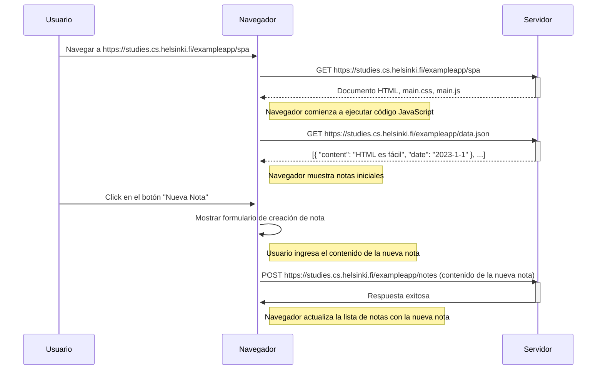

```mermaid 

sequenceDiagram

    participant Usuario
    participant Navegador
    participant Servidor

    Usuario->>Navegador: Navegar a https://studies.cs.helsinki.fi/exampleapp/spa
    activate Navegador
    Navegador->>Servidor: GET https://studies.cs.helsinki.fi/exampleapp/spa
    activate Servidor
    Servidor-->>Navegador: Documento HTML, main.css, main.js
    deactivate Servidor

    Note right of Navegador: Navegador comienza a ejecutar código JavaScript

    Navegador->>Servidor: GET https://studies.cs.helsinki.fi/exampleapp/data.json
    activate Servidor
    Servidor-->>Navegador: [{ "content": "HTML es fácil", "date": "2023-1-1" }, ...]
    deactivate Servidor

    Note right of Navegador: Navegador muestra notas iniciales

    Usuario->>Navegador: Click en el botón "Nueva Nota"
    Navegador->>Navegador: Mostrar formulario de creación de nota
    Note right of Navegador: Usuario ingresa el contenido de la nueva nota
    Navegador->>Servidor: POST https://studies.cs.helsinki.fi/exampleapp/notes (contenido de la nueva nota)
    activate Servidor
    Servidor->>Navegador: Respuesta exitosa
    deactivate Servidor

    Note right of Navegador: Navegador actualiza la lista de notas con la nueva nota


```
